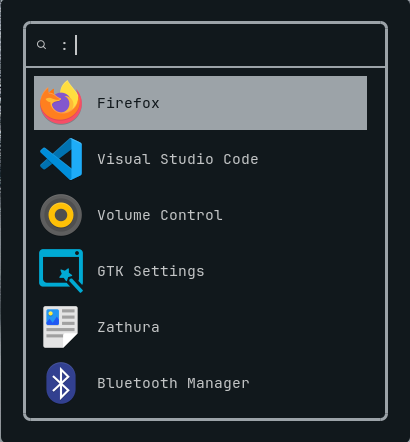
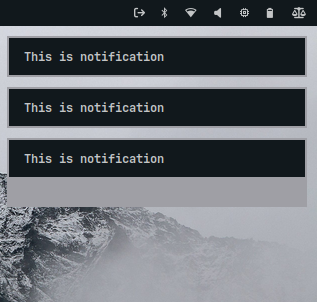

# 🌿 Arch Linux Dotfiles

<p align="center">
  
  
</p>
<p align="center">
  
  
  
</p>

---

## 🧠 Overview

This repository contains my **personal Arch Linux dotfiles**, designed for a clean, lightweight, and modern workflow.  
All configs are organized using **GNU Stow** for easy management.

My Laptop:
- 💻 Intel Celeron N4020 + Intel UHD Graphics 600
- ⚡ 8GB DDR4 2400MHz RAM

---

## 📂 Folder Structure

```bash
arch-dotfiles/
├── fastfetch/.config/fastfetch/
├── hypr/.config/hypr/
├── kitty/.config/kitty/
├── mako/.config/mako/
├── nvim/.config/nvim/
├── rofi/.config/rofi/
├── waybar/.config/waybar/
└── screenshots/

